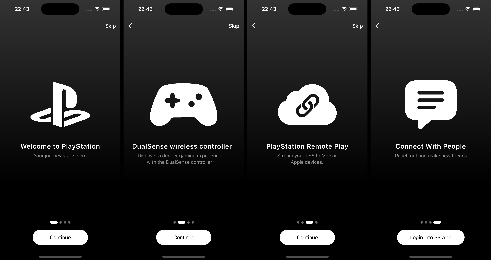

# SwiftUI App Intro Animations - Shape Morphing Effect & Walkthrough Page Animations、


## Introduction

This project showcases an elegantly designed app introduction interface built with SwiftUI. The app features smooth shape morphing effects and seamless walkthrough page transitions. These animations not only enhance the user experience but also create an interactive and visually appealing onboarding process for any app.

### Key Features:
- **Shape Morphing Animations:** Stunning morphing effects where shapes transition between different forms, creating a dynamic visual experience.
- **Walkthrough Page Animations:** Smooth and responsive animations for the onboarding pages, guiding users through key features of the app.
- **SwiftUI Framework:** Fully developed using SwiftUI, ensuring fast performance, fluid animations, and declarative syntax.
- **Customizable Design:** Easily modifiable to fit your app’s branding and theme.

## Preview



## Installation

### Requirements:
- **iOS 14+** or later
- **Xcode 12+** or later
- **Swift 5.3** or later

### Steps to Install:
1. Clone the repository:
    ```bash
    git clone  git@github.com:nicolastinkl/SwiftUI-Intro.git
    ```
2. Open the project in Xcode:
    ```bash
    cd swiftui-app-intro-animation
    open AppIntroAnimation.xcodeproj
    ```
3. Build and run the app on a simulator or connected device:
    ```bash
    xcodebuild -project AppIntroAnimation.xcodeproj -scheme AppIntroAnimation -destination 'platform=iOS Simulator,name=iPhone 12'
    ```

## Usage

The app’s structure is simple to modify for different types of onboarding content:

1. **Shape Morphing Effect**: The shape morphing effect is managed using SwiftUI’s `Path` and `AnimatableData`. Each page of the walkthrough can contain different shapes that morph as users navigate through the app.
2. **Walkthrough Pages**: Walkthrough pages are created using a `TabView` and animated transitions. Customization of each page's content is easily handled through SwiftUI's view system.

### Customization:

To customize the walkthrough pages:
- Modify the `WalkthroughView.swift` file to add new content or adjust the number of pages.
- Customize the shape transitions by editing the `ShapeMorphingView.swift` file.

## Example Code

Here is a snippet of the main animation logic:

```swift
struct ContentView: View {
    var body: some View {
        IntroView()
            .environment(\.colorScheme, .dark)
    }
}

#Preview {
    ContentView()
}

```

## Contribution

Contributions are welcome! If you'd like to improve the animations or add new features, please feel free to open a pull request.

## License

This project is licensed under the MIT License - see the [LICENSE](LICENSE) file for details.
